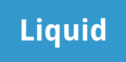
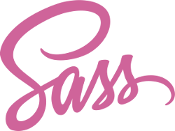

# Reference 

The basic components of the Jekyll stack are described below.

 

# Markdown

[Markdown](https://daringfireball.net/projects/markdown/) is a standard to [simplify writing](https://evanwill.github.io/_drafts/notes/writing-markdown.html) content for the web. 
[GitHub markdown flavor](https://help.github.com/articles/basic-writing-and-formatting-syntax/) can be used any where on GitHub and in Jekyll.
The basics are intuitive, you can learn in about a minute!

This Markdown code:

```
## Heading two

### Heading three, etc.

Any text with no empty lines between will become a paragraph.
Font can be *Italic* or **Bold**.
Code can be highlighted with `backticks`.

Links look like this [GitHub Help](https://help.github.com/).

List:
- dog
- cat

Numbered:
1. one
2. two 

> Block quote.
```

Will be rendered like this:

## Heading two

### Heading three, etc.

Any text with no empty lines between will become a paragraph.
Font can be *Italic* or **Bold**.
Code can be highlighted with `backticks`.

Links look like this [GitHub Help](https://help.github.com/).

List:
- dog
- cat

Numbered:
1. one
2. two 

> Block quote.

 

# YAML

[YAML](http://www.yaml.org/) is a human readable plain text data format.
It is used in Jekyll for configuration, site data, and front matter:

- Jekyll projects are [configured](https://jekyllrb.com/docs/configuration/) using the `_config.yml` file.
- YAML, JSON, or CSV files in the `_data` directory are exposed by Jekyll as [site data](https://jekyllrb.com/docs/datafiles/) for Liquid templating.
- Any file in a Jekyll project with YAML [Front matter](https://jekyllrb.com/docs/frontmatter/) will be processed, others are just directly copied the the `_site` directory on build.
For example, the front matter for the markdown file generating this page looks like:
```
---
layout: default
title: 5-Ref
---
```

 

# Liquid

[Liquid](http://shopify.github.io/liquid/) is a flexible template language.
[In Jekyll](https://jekyllrb.com/docs/templates/) it allows you to layout pages built from modular components and data, using the `_includes`, `_layouts`, and `_data` directories.
Liquid includes features such as operators, loops, and filters to manipulate raw content. 
Liquid statements are enclosed by `` and variables in `{{  }}`.
For example, the `default` layout used for this page looks like:

```
<!DOCTYPE html>
<html lang="en">
  
  <body>
    
    <main class="page-content" aria-label="Content">
      <div class="wrapper">
        {{ content }}
      </div>
    </main>
    
  </body>
</html>
```




# Sass  

[Sass](http://sass-lang.com/) is a CSS extension / preprocessor. 
All normal CSS is valid SCSS, but Sass adds many powerful functions and programatic features. 
Writing SCSS is often easier and more sensible, for example by supporting nesting, variables, and operators. 
Jekyll lets you write SASS in modular chucks called partials, in the `_sass` directory, that will be combined and compiled into normal CSS files when the site is built.
For example, notice the variables, nesting, and operators in the SCSS below:

```
$base-font-family: Helvetica, sans-serif;
$base-font-size: 16px;
$primary-color: #333;
$padding-links: 6px 12px;

nav {
    font-family: $base-font-family;
    font-size: $base-font-size * 1.25;
    color: lighten($primary-color, 25%);
    ul {
        list-style: none;
    }
    li { display: inline-block; }
    a {
        padding: $padding-links;
        text-decoration: none;
    }
}

@import "base";
```

# Themes

[Jekyll themes](https://jekyllrb.com/docs/themes/) are really just a skeleton of directories and files making up a project. 
Some are Gems and can be installed by adding the theme to the config and gem file. 
You will not see the theme directories, such as `assets`, `_layouts`, `_includes`, and `_sass`. 
Others should just be downloaded and added to your project directory manually.
- [Jekyll Directory](http://themes.jekyllrc.org/)
- [Themes supported by gh-pages](https://pages.github.com/themes/) (these can be added to `_config.yml` as in 3-Jekyll example).
